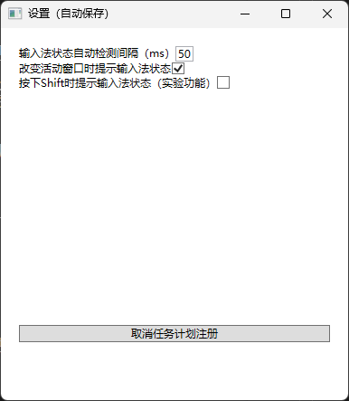

# MouseHalo

在鼠标附近显示输入法中英状态和复制提示。

## emoji对应表

| emoji | 说明 |
| --- | --- |
| 🀄 | 中文 |
| 🔤 | 英文 |
| 📁 | FileDrop |
| 🖼 | Bitmap |
| 🕸 | Html |
| 📗 | Rtf |
| 📄 | Text |
| ❓︎ | 其他情况 |

## 设置页面

## 说明

中英状态显示是xyq一直以来想要实现的功能，但是由于水平原因一直没有实现。近期参考[ImTip](https://github.com/aardio/ImTip)试着用WPF摸了出来。

其实从内存占用和Win32 API交互难度考虑WPF并不是合适的选择（

不知道为什么xyq的PC按下Ctrl+C有时候不会复制，试着把剪贴板的反馈也做了一下

## 权限

在非管理员权限下运行似乎会导致无法获取输入法状态，具体原因未知

可选的开机启动是通过“任务计划程序”实现的，也可以自行管理
